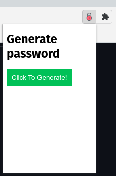
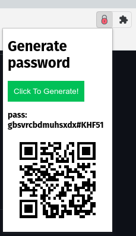

# Password Generator - a chrome extension

It's main purpose is to generate passwords for the site. Since google suggested password doesn't work without the logged in user. And just wanted to generate a one time password for the site.

## QRCode generator 

Just in case want's to save it over the mobile devices.

## Demo

1. Extension

2. Generate Password

## Local Installation and setup

1. Enable developer option in chrome extension

2. Load the folder : click on Load Unpacked

3. Extension is ready to use

